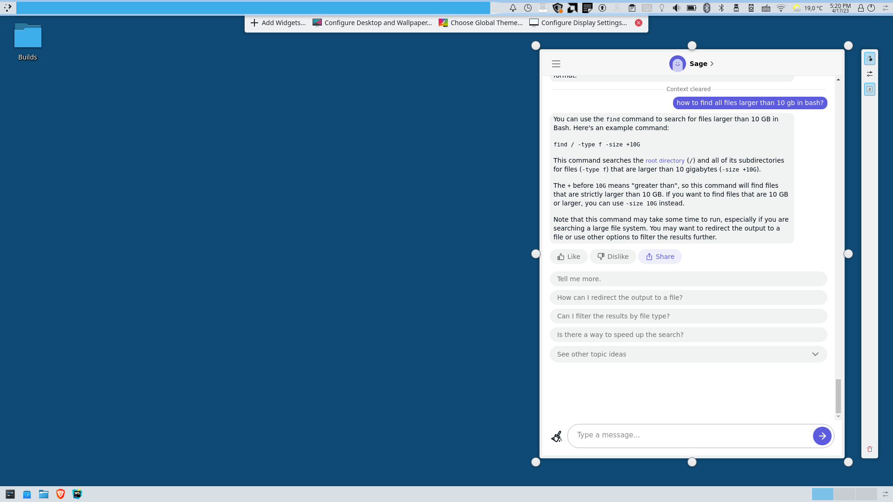

# Usage

A basic KDE5 Plasma widget that loads https://poe.com/ and provides a desktop ai chat bot.

Download release/poe.ai-widget.plasmoid and install the widget in KDE5.

Optionally, change main.qml to point to the URL of your own bot.

To change font sizes, please use branch ```experiments/reduce-screen-size```, edit contents/ui/main.qml to suit your needs:

```javascript
runJavaScript("window.document.styleSheets[0].insertRule('* { font-size: 90%; }', 0);")
```

Update ```font-size``` to a lower or higher value.

# Local testing

Trick plasma into thinking this plasmoid is already installed (if already installed, remove it for testing):

mkdir -p /home/$(whoami)/.local/share/plasma/plasmoids/poe.ai-widget

sudo mount --bind /home/$(whoami)/.local/share/plasma/plasmoids/poe.ai-widget .

And preview it:

plasmawindowed poe.ai-widget

# Screenshot




